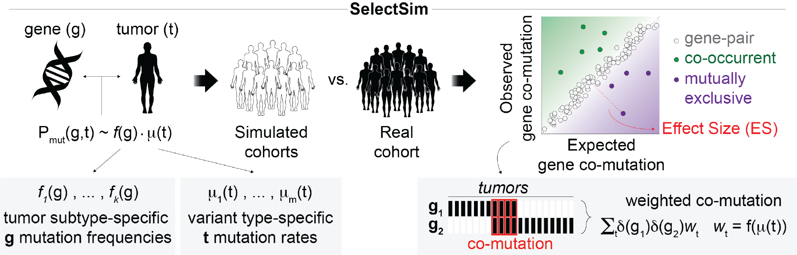

<!-- README.md is generated from README.Rmd. Please edit that file -->

# SelectSim <a href="https://csogroup.github.io/SelectSim/"></a>

<!-- badges: start -->

[](https://github.com/CSOgroup/SelectSim/actions/workflows/R-CMD-check.yaml)
[](https://doi.org/10.5281/zenodo.19680236)
<!-- badges: end -->

SelectSim is an R package that infers evolutionary dependencies i.e
co-mutations and mutual exclusivities — between functional alterations
across cancer genomes. It estimates the expected co-mutation frequency
for each gene pair from individual mutation frequencies and per-sample
tumor mutation burden (TMB), then evaluates significance against a
simulation based null model.

<figure>

<figcaption aria-hidden="true">SelectSim Method</figcaption>
</figure>

The method accounts for heterogeneous tumor types, tissue specificities,
and distinct mutational processes through a covariate-aware weighting
scheme. Significance is assessed as a weighted effect size with
frequency-stratified FDR control generated via simulation.

This package accompanies the manuscript:

> Iyer A, Mina M, Petrovic M, Ciriello G (2026). Evolving patterns of
> co-mutations from tumor initiation to metastatic progression. *TBD*.
> doi: *TBD*

## Installation

You can install the development version of SelectSim from
[GitHub](https://github.com/CSOgroup/SelectSim) with:

``` r
# install.packages("pak")
pak::pak("CSOgroup/SelectSim")
```

For more details on installation refer to
[INSTALLATION](INSTALLATION.md).

## Quick start

``` r
library(SelectSim)
library(dplyr)

# Load the bundled TCGA LUAD example data
data(luad_run_data, package = "SelectSim")

# Run SelectSim (1 000 permutations, single core)
result <- selectX(
  M                = luad_run_data$M,
  sample.class     = luad_run_data$sample.class,
  alteration.class = luad_run_data$alteration.class,
  n.cores          = 1,
  min.freq         = 10,
  n.permut         = 1000,
  lambda           = 0.3,
  tau              = 1,
  maxFDR           = 0.25
)

# Significant evolutionary dependencies at FDR ≤ 0.25
result$result |> filter(nFDR2 <= 0.25) |> head()
```

For a full walkthrough see the [Introduction
vignette](https://csogroup.github.io/SelectSim/articles/introduction.html).

## Documentation

Full documentation and vignettes are available at
<https://csogroup.github.io/SelectSim/>.

## Citation

If you use SelectSim in your research, please cite:

> Iyer A, Mina M, Petrovic M, Ciriello G (2026). Evolving patterns of
> co-mutations from tumor initiation to metastatic progression. *TBD*.
> doi: *TBD*

You can also run `citation("SelectSim")` inside R for a formatted
reference.

## Contact

- For bugs or feature requests, please use the [issue
  tracker](https://github.com/CSOgroup/SelectSim/issues).
- For other questions, contact Prof. Giovanni Ciriello
  (<giovanni.ciriello@unil.ch>) or Arvind Iyer
  (<ayalurarvind@gmail.com>).
