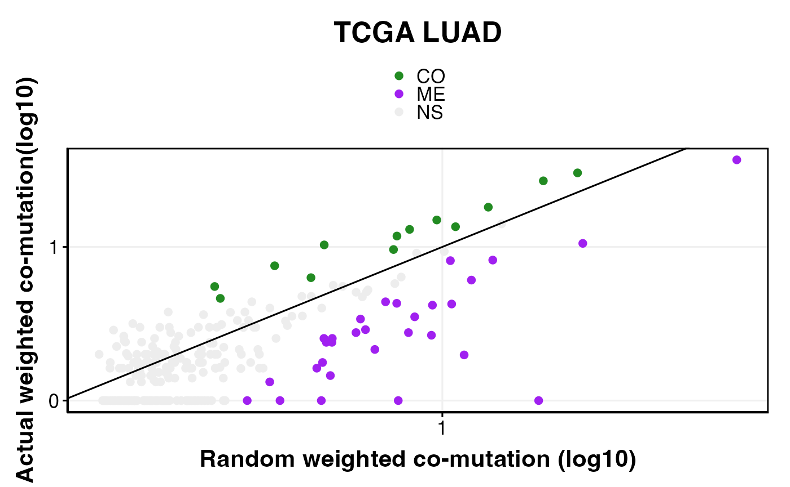

# Introduction to SelectSim

SelectSim infers evolutionary dependencies — co-mutations and mutual
exclusivities — between functional alterations across cancer genomes. It
estimates expected co-mutation frequencies from individual gene mutation
rates and per-sample tumor mutation burden (TMB), then evaluates
significance against a permutation null model.


SelectSim Method

This package accompanies the manuscript: Iyer A, Mina M, Petrovic M,
Ciriello G (2026). *Evolving patterns of co-mutations from tumor
initiation to metastatic progression.* Nature Genetics.

### Installation

- You can install the development version of SelectSim from
  [GitHub](https://github.com/CSOgroup/SelectSim) with:

``` r

# install.packages("devtools")
devtools::install_github("CSOgroup/SelectSim",dependencies = TRUE, build_vignettes = TRUE)
```

- For more details on installation refer to
  [INSTALLATION](https://github.com/CSOgroup/SelectSim/blob/main/INSTALLATION.md)

### Example

- We will run SelectSim algorithm on processed LUAD dataset from TCGA
  provided with the package.
- Note: This is an example for running a processed data. Check other
  vignette to process the data to create the run_data object needed as
  input for SelectSim algorithm.

``` r

library(SelectSim)
library(dplyr)
#> 
#> Attaching package: 'dplyr'
#> The following objects are masked from 'package:stats':
#> 
#>     filter, lag
#> The following objects are masked from 'package:base':
#> 
#>     intersect, setdiff, setequal, union
## Load the data provided with the package
data(luad_run_data, package = "SelectSim")
```

#### Data Description & Format

- The loaded data is list object which consists of
  - M: a list object of GAMs which is presence absence matrix of
    alterations
  - tmb: a list object of tumor mutation burden as data frame with
    column names (should be) as sample and mutation
  - sample.class a named vector of sample annotations
  - alteration.class a named vector of alteration annotations

``` r

# Check the data structure
str(luad_run_data)
#> List of 3
#>  $ M               :List of 2
#>   ..$ M  :List of 2
#>   .. ..$ missense  : num [1:396, 1:502] 0 0 0 0 0 0 0 0 0 0 ...
#>   .. .. ..- attr(*, "dimnames")=List of 2
#>   .. .. .. ..$ : chr [1:396] "AKT1" "ALK" "APC" "AR" ...
#>   .. .. .. ..$ : chr [1:502] "TCGA-05-4244-01" "TCGA-05-4249-01" "TCGA-05-4250-01" "TCGA-05-4382-01" ...
#>   .. ..$ truncating: num [1:396, 1:502] 0 0 0 0 0 0 0 0 0 0 ...
#>   .. .. ..- attr(*, "dimnames")=List of 2
#>   .. .. .. ..$ : chr [1:396] "AKT1" "ALK" "APC" "AR" ...
#>   .. .. .. ..$ : chr [1:502] "TCGA-05-4244-01" "TCGA-05-4249-01" "TCGA-05-4250-01" "TCGA-05-4382-01" ...
#>   ..$ tmb:List of 2
#>   .. ..$ missense  :'data.frame':    502 obs. of  2 variables:
#>   .. .. ..$ sample  : chr [1:502] "TCGA-05-4244-01" "TCGA-05-4249-01" "TCGA-05-4250-01" "TCGA-05-4382-01" ...
#>   .. .. ..$ mutation: num [1:502] 163 253 270 1328 100 ...
#>   .. ..$ truncating:'data.frame':    502 obs. of  2 variables:
#>   .. .. ..$ sample  : chr [1:502] "TCGA-05-4244-01" "TCGA-05-4249-01" "TCGA-05-4250-01" "TCGA-05-4382-01" ...
#>   .. .. ..$ mutation: num [1:502] 24 45 40 206 17 18 73 31 176 108 ...
#>  $ sample.class    : Named chr [1:502] "LUAD" "LUAD" "LUAD" "LUAD" ...
#>   ..- attr(*, "names")= chr [1:502] "TCGA-05-4244-01" "TCGA-05-4249-01" "TCGA-05-4250-01" "TCGA-05-4382-01" ...
#>  $ alteration.class: Named chr [1:396] "MUT" "MUT" "MUT" "MUT" ...
#>   ..- attr(*, "names")= chr [1:396] "AKT1" "ALK" "APC" "AR" ...
```

#### Running SelectSim

- We use the function
  [`selectX()`](https://csogroup.github.io/SelectSim/reference/selectX.md)
  which generates the background model and results.

| Parameter          | Description                                            |
|--------------------|--------------------------------------------------------|
| `M`                | List of GAMs and TMB matrices                          |
| `sample.class`     | Named vector of sample covariates                      |
| `alteration.class` | Named vector of alteration covariates                  |
| `min.freq`         | Minimum number of samples a feature must be mutated in |
| `n.permut`         | Number of permutations for the null model              |
| `lambda`           | Penalty factor for the weight computation              |
| `tau`              | Fold change threshold for the weight computation       |
| `maxFDR`           | FDR cutoff for calling significant results             |

- The function returns a list object which contains the background model
  and results.

``` r

result_obj<- SelectSim::selectX(  M = luad_run_data$M,
                      sample.class = luad_run_data$sample.class,
                      alteration.class = luad_run_data$alteration.class,
                      n.cores = 1,
                      min.freq = 10,
                      n.permut = 1000,
                      lambda = 0.3,
                      tau = 1,
                      save.object = FALSE,
                      verbose = FALSE,
                      estimate_pairwise = FALSE,
                      maxFDR = 0.25)
```

#### Interpreting the results

- Lets look into the results

``` r

head(result_obj$result[,1:10],n=5)
#>              SFE_1 SFE_2         name support_1 support_2     freq_1    freq_2
#> KRAS - TP53   KRAS  TP53  KRAS - TP53       154       221 0.30677291 0.4402390
#> EGFR - KRAS   EGFR  KRAS  EGFR - KRAS        57       154 0.11354582 0.3067729
#> STK11 - TP53 STK11  TP53 STK11 - TP53        59       221 0.11752988 0.4402390
#> BRAF - KRAS   BRAF  KRAS  BRAF - KRAS        35       154 0.06972112 0.3067729
#> KRAS - STK11  KRAS STK11 KRAS - STK11       154        59 0.30677291 0.1175299
#>              overlap  w_overlap max_overlap
#> KRAS - TP53       49 35.8760174         154
#> EGFR - KRAS        0  0.0000000          57
#> STK11 - TP53      13  9.5456386          59
#> BRAF - KRAS        2  0.9821429          35
#> KRAS - STK11      28 25.9230769          59
```

##### Filtering significant hits

``` r

# Filtering significant hits and counting EDs
result_obj$result %>% filter(nFDR2<=0.25) %>% head(n=2)
#>             SFE_1 SFE_2        name support_1 support_2    freq_1    freq_2
#> KRAS - TP53  KRAS  TP53 KRAS - TP53       154       221 0.3067729 0.4402390
#> EGFR - KRAS  EGFR  KRAS EGFR - KRAS        57       154 0.1135458 0.3067729
#>             overlap w_overlap max_overlap freq_overlap r_overlap w_r_overlap
#> KRAS - TP53      49  35.87602         154    0.3181818  98.63545    58.47438
#> EGFR - KRAS       0   0.00000          57    0.0000000  31.23746    16.91865
#>                   wES wFDR       nES mean_r_nES nFDR cum_freq nFDR2 type  FDR
#> KRAS - TP53 -15.97946    0 -13.98576  -1.993698    0      375     0   ME TRUE
#> EGFR - KRAS -11.96329    0 -10.70753  -1.255762    0      211     0   ME TRUE
result_obj$result %>% filter(nFDR2<=0.25) %>% count(type)
#>   type  n
#> 1   CO 13
#> 2   ME 30
```

##### Plotting a scatter plot of co-mutation

``` r

# Filtering significant hits and plotting
options(repr.plot.width = 7, repr.plot.height = 7)
obs_exp_scatter(result = result_obj$result,title = 'TCGA LUAD')
```



### SessionInfo

``` r

# Print the sessionInfo
sessionInfo()
#> R version 4.5.3 (2026-03-11)
#> Platform: aarch64-apple-darwin20.0.0
#> Running under: macOS Sequoia 15.7.3
#> 
#> Matrix products: default
#> BLAS/LAPACK: /Users/arvind/.local/share/mamba/envs/r_env/lib/libopenblas.0.dylib;  LAPACK version 3.12.0
#> 
#> locale:
#> [1] en_US.UTF-8/en_US.UTF-8/en_US.UTF-8/C/en_US.UTF-8/en_US.UTF-8
#> 
#> time zone: America/Toronto
#> tzcode source: system (macOS)
#> 
#> attached base packages:
#> [1] stats     graphics  grDevices utils     datasets  methods   base     
#> 
#> other attached packages:
#> [1] dplyr_1.2.1     SelectSim_0.1.6
#> 
#> loaded via a namespace (and not attached):
#>  [1] sass_0.4.10           generics_0.1.4        tidyr_1.3.2          
#>  [4] rstatix_0.7.3         lattice_0.22-9        digest_0.6.39        
#>  [7] magrittr_2.0.5        evaluate_1.0.5        grid_4.5.3           
#> [10] RColorBrewer_1.1-3    iterators_1.0.14      fastmap_1.2.0        
#> [13] Matrix_1.7-5          foreach_1.5.2         doParallel_1.0.17    
#> [16] jsonlite_2.0.0        backports_1.5.1       Formula_1.2-5        
#> [19] purrr_1.2.2           doRNG_1.8.6.3         scales_1.4.0         
#> [22] codetools_0.2-20      textshaping_1.0.5     jquerylib_0.1.4      
#> [25] abind_1.4-8           cli_3.6.6             zigg_0.0.2           
#> [28] rlang_1.2.0           withr_3.0.2           cachem_1.1.0         
#> [31] yaml_2.3.12           otel_0.2.0            tools_4.5.3          
#> [34] parallel_4.5.3        ggsignif_0.6.4        ggplot2_4.0.3        
#> [37] ggpubr_0.6.3          rngtools_1.5.2        Rfast_2.1.5.2        
#> [40] broom_1.0.13          vctrs_0.7.3           R6_2.6.1             
#> [43] ggridges_0.5.7        lifecycle_1.0.5       fs_2.1.0             
#> [46] car_3.1-5             htmlwidgets_1.6.4     ragg_1.5.2           
#> [49] pkgconfig_2.0.3       desc_1.4.3            RcppParallel_5.1.11-2
#> [52] pkgdown_2.2.0         bslib_0.11.0          pillar_1.11.1        
#> [55] gtable_0.3.6          Rcpp_1.1.1-1.1        glue_1.8.1           
#> [58] systemfonts_1.3.2     xfun_0.57             tibble_3.3.1         
#> [61] tidyselect_1.2.1      knitr_1.51            farver_2.1.2         
#> [64] htmltools_0.5.9       rmarkdown_2.31        carData_3.0-6        
#> [67] compiler_4.5.3        S7_0.2.2
```
